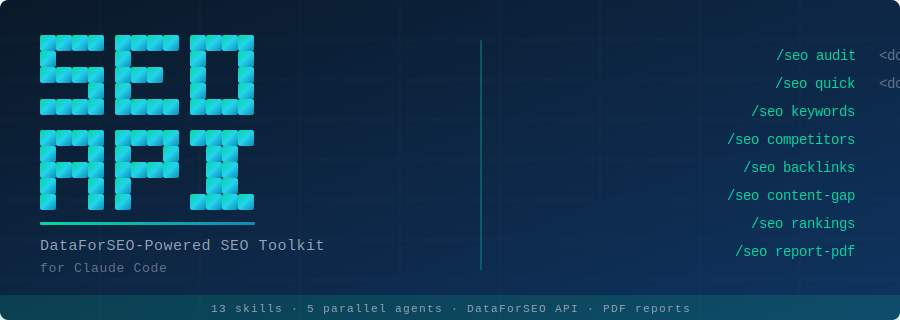

<p align="center">
  
</p>

<p align="center">
  <strong>SEO Agency Killer</strong> for Claude Code — powered by the DataForSEO API.
</p>

<p align="center">
  Replace the data layer of an SEO agency with one command.<br/>
  Real Google data. No scraping. No browsing. No guesswork.
</p>

---

## What you get

**One command in. Real Google data out.** Type `/seo audit example.com` and Claude
fires five specialist subagents in parallel — each one pulls live data from
DataForSEO's APIs (keywords, SERPs, backlinks, on-page, domain analytics) — and
returns a composite SEO Score (0-100) with a prioritized action plan and a
client-ready PDF.

| Capability | Command |
|---|---|
| Full audit (composite score + PDF) | `/seo audit <domain>` |
| 60-second snapshot | `/seo quick <domain>` |
| Keyword research | `/seo keywords <seed>` |
| Technical site crawl | `/seo technical <domain>` |
| Competitor map | `/seo competitors <domain>` |
| Content topical authority | `/seo content <domain>` |
| Backlink profile + toxicity | `/seo backlinks <domain>` |
| On-demand rank check | `/seo rankings <domain> kw1 kw2 ...` |
| Content gap vs competitors | `/seo content-gap <you> <competitor>` |
| Head-to-head comparison | `/seo compare <d1> <d2>` |
| Multi-domain watchlist | `/seo watchlist add/list/check` |
| Markdown report | `/seo report <domain>` |
| PDF report | `/seo report-pdf <domain>` |

---

## Install

### One-command install (macOS / Linux)

```bash
curl -fsSL https://raw.githubusercontent.com/zubair-trabzada/dataforseo-claude/main/install.sh | bash
```

That's it. The installer creates an isolated Python venv, installs the 13
skills, the 5 subagents, the shared DataForSEO client, and a starter `.env`.

### Then add your DataForSEO credentials

1. Sign up at **[dataforseo.com/register](https://dataforseo.com/register)** — free trial includes $1 credit (enough for ~10 full audits).
2. Open `~/.claude/skills/seo/.env` and fill in:
   ```
   DATAFORSEO_LOGIN=your_login_email
   DATAFORSEO_PASSWORD=your_api_password
   ```

Done. Open Claude Code and try `/seo quick example.com`.

---

## Quick examples

```bash
# 60-second snapshot
/seo quick stripe.com

# Full audit with PDF
/seo audit stripe.com
/seo report-pdf stripe.com

# Keyword research
/seo keywords "ai seo tool"

# Find what your competitor ranks for that you don't
/seo content-gap mysite.com biggercompetitor.com

# Track rankings for a list of target keywords
/seo rankings mysite.com "seo audit" "keyword research" "site speed"
```

---

## What's inside

```
~/.claude/
├── skills/
│   ├── seo/                       Main orchestrator + scripts + venv
│   │   ├── SKILL.md
│   │   ├── scripts/
│   │   │   ├── dataforseo_client.py       Shared API client
│   │   │   ├── keyword_research.py        Keywords Data + Labs
│   │   │   ├── serp_check.py              SERP API rank checks
│   │   │   ├── backlinks.py               Backlinks API
│   │   │   ├── on_page_audit.py           On-Page API site crawls
│   │   │   ├── domain_overview.py         Labs domain analytics
│   │   │   └── generate_pdf_report.py     PDF generator (ReportLab)
│   │   └── .env                            Your credentials
│   ├── seo-audit/                 Composite score orchestrator
│   ├── seo-quick/                 60-second snapshot
│   ├── seo-keywords/              Keyword research
│   ├── seo-technical/             Technical audit
│   ├── seo-competitors/           Competitor analysis
│   ├── seo-content/               Topical authority
│   ├── seo-backlinks/             Backlink profile
│   ├── seo-rankings/              On-demand SERP checks
│   ├── seo-content-gap/           Gap vs competitors
│   ├── seo-compare/               Head-to-head
│   ├── seo-watchlist/             Multi-domain tracking
│   ├── seo-report/                Markdown deliverable
│   └── seo-report-pdf/            PDF deliverable
└── agents/
    ├── seo-keywords.md            Subagent (parallel audit)
    ├── seo-technical.md
    ├── seo-competitors.md
    ├── seo-content.md
    └── seo-backlinks.md
```

---

## Cost

A typical full audit uses **~$0.10–$0.30** of DataForSEO credit. The free
trial ($1) gets you 4–10 audits — enough to evaluate the tool. Pricing details
at [dataforseo.com/apis](https://dataforseo.com/apis).

The shared API client uses **live endpoints** (synchronous) wherever possible
so commands feel instant. Only the full-site crawl (`/seo technical`) takes a
few minutes — that's the API doing real work, not waiting in a queue.

---

## Requirements

- macOS or Linux (Windows via Git Bash works but isn't actively tested)
- Python 3.8+
- [Claude Code CLI](https://docs.claude.com/en/docs/claude-code)
- [DataForSEO account](https://dataforseo.com/register)

---

## Acknowledgments

This skill pack was built as a sponsored collaboration with **DataForSEO**.
DataForSEO provides the comprehensive SEO data API that powers every command
above — search volumes, SERPs, backlinks, technical crawls, and domain
analytics. Sign up at [dataforseo.com](https://dataforseo.com/register).

Built with [Claude Code](https://docs.claude.com/en/docs/claude-code) by
[Zubair / AI Workshop](https://www.youtube.com/@TheAIWorkshop). For tutorials
on building tools like this and selling them to local businesses, check out
the YouTube channel.

---

## License

MIT — see [LICENSE](LICENSE).
